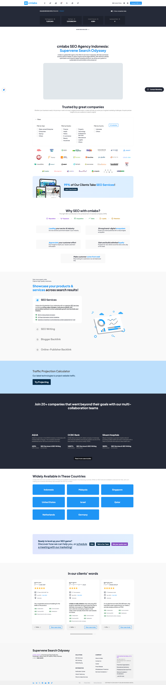
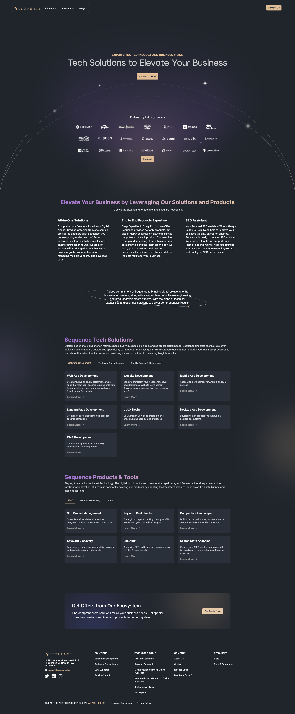
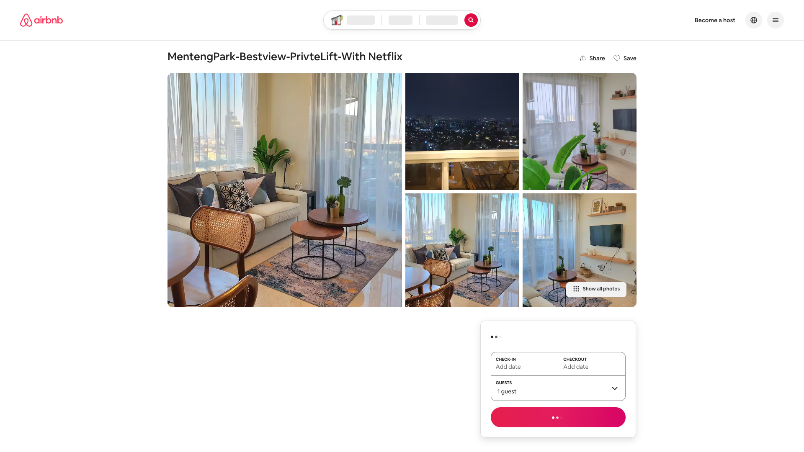
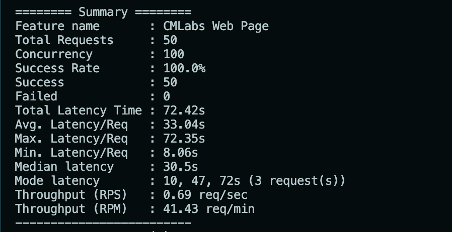

# cmlabs-backend-crawler-freelance-test

A Node.js web crawler service built with TypeScript, Express, and Puppeteer.

## Tech Stack

- **Runtime:** Node.js (ESM)
- **Language:** TypeScript
- **Framework:** Express v5
- **Crawler:** Puppeteer + Fingerprint Injector
- **Logging:** Winston + Daily Rotate File
- **Validation:** Yup
- **Package Manager:** npm

## How It Handles

This crawler uses `Puppeteer`, a headless Chromium browser, which means it executes JavaScript fully before extracting content.

- SPA (Single Page Application): Puppeteer waits for the JavaScript bundle to execute and the DOM to render, capturing the fully hydrated page.
- SSR (Server-Side Rendered): For SSR pages, the server already returns complete HTML. Puppeteer still loads the page fully.
- PWA (Progressive Web App): Since Puppeteer runs a real browser context, service workers and dynamic asset loading are handled natively.

`fingerprint-injector` is applied on each browser request to randomize browser fingerprints, reducing the chance of being blocked by anti-bot mechanisms across all three rendering types.

## HTML Data

Crawl HTML is saved automatically to `data/html/` during crawler execution, named by timestamp and URL.

## Screenshots Data

Crawl screenshots are saved automatically to `data/screenshots/` during crawler execution in format timestamp and URL.

**https://cmlabs.co**



**https://www.sequence.day/**



**https://airbnb.com/**



## API Endpoints

Base URL: `http://localhost:5001`

All endpoints follow the same pattern with different collection targets:

| Method | Endpoint                                 | Description                                 |
| ------ | ---------------------------------------- | ------------------------------------------- |
| GET    | `/api/cmlabs/get-webpage?url=<url>`      | Crawl a webpage via the cmlabs crawler      |
| GET    | `/api/airbnb/get-webpage?url=<url>`      | Crawl a webpage via the airbnb crawler      |
| GET    | `/api/sequenceday/get-webpage?url=<url>` | Crawl a webpage via the sequenceday crawler |

### Query Parameters

| Parameter | Type   | Required | Description             |
| --------- | ------ | -------- | ----------------------- |
| `url`     | string | Yes      | The target URL to crawl |

### Example

```bash
GET http://localhost:5001/api/cmlabs/get-webpage?url=https://cmlabs.co
GET http://localhost:5001/api/sequenceday/get-webpage?url=https://sequence.day
GET http://localhost:5001/api/airbnb/get-webpage?url=https://airbnb.com/rooms/949176831519114376
```

## Getting Started

### Prerequisites

- Node.js >= 18
- npm >= 10

### Clone

```bash
git clone https://github.com/Diaz-adrianz/cmlabs-backend-crawler-freelance-test
cd cmlabs-backend-crawler-freelance-test
```

### Install dependencies

```bash
npm install
```

### Environment

Create a `.env` file in the project root:

```bash
NODE_ENV=development
APP_NAME=node-crawler
PORT=5001
```

### Run in development

```bash
npm run dev
```

### Build for production

```bash
npm run build
```

### Run production build

```bash
npm start
```

## Scripts

| Script               | Description                      |
| -------------------- | -------------------------------- |
| `npm run dev`        | Start dev server with hot reload |
| `npm run build`      | Compile TypeScript to `dist/`    |
| `npm start`          | Run compiled production build    |
| `npm run lint`       | Lint with ESLint                 |
| `npm run lint:fix`   | Auto-fix lint issues             |
| `npm run format`     | Check formatting with Prettier   |
| `npm run format:fix` | Auto-fix formatting              |

## Stress Test — Browser Concurrency 3

The crawler was stress tested for sample `/api/cmlabs/get-webpage?url=https://cmlabs.co` with browser tasks `concurrency=3`.


